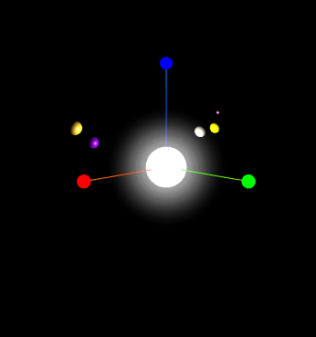
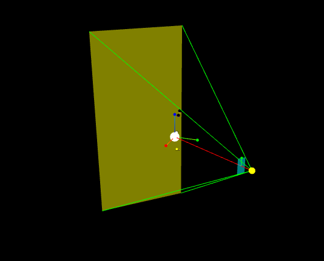
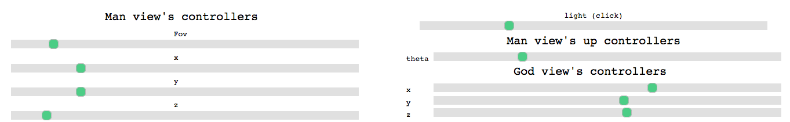

# THREE.js Solar System Animation

This scene is some kind of didactic work to show the basic parameters of a THREE.js camera.

## Left view

A small and simple representation of a solar system, with a modulable number of planets
rotating around a sun on random orbits.

## Right view

A god view to visualize the different parameters of left view's camera, which are:
* the position of the camera
* the two angles of the camera (fov)
* the close and far planes

  

## Sliders

To modify all parameters, and visualize the impact on both views (I also added a light strength
modification to test a bit how to represent a degressive light with multiple more and more 
transparent spheres around the sun

# How to make it work

To make it work, download the repo, then use the following process: https://threejs.org/docs/index.html#manual/en/introduction/How-to-run-things-locally

To sum it up, just run a localhost on your machine (I personally use python -m http.server), then
go to your localhost on your browser and just admire the result.

If you have any suggestion, do not hesitate and leave a comment or a pull request, I'd be happy
to add it to the project.
